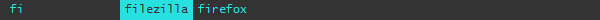
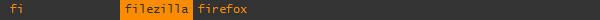

amenu
=====

amenu is a simple and customizable application launcher very much inspired by the excellent [dmenu](http://tools.suckless.org/dmenu/). Consider amenu a Windows alternative to dmenu if you only use the latter to run executable files.

Installation
------------

Download and run the [amenu.exe](https://github.com/owlnical/amenu/releases/latest) or clone the [repo](https://github.com/owlnical/amenu/) and run amenu.ahk. The [default paths](settings/paths.ini) will be scanned for exe files.

Usage
-----

 1. Press `win + space` to open the amenu interface.
 2. Start typing to search for executables.
 3. Use `←` `→` or `tab` `shift + tab` to change selection.
 4. Press `enter` to launch the selected program.

### Example



The default GUI showing the search string "fi" which matches two files in the database. Filezilla will be started when enter is pressed. Unless the selection is changed or the search pattern is narrowed down further.

Settings
---------

There are three separate files for settings available via the tray menu:

 - `paths.ini` - directories to be scanned for .exe files.
 - `hotkeys.ini` - key combinations to show and interact with the GUI.
 - `misc.ini`  - miscellaneous settings.

### Theme

There are two variations of the default theme included with amenu. Both of them load the default first and simply change the color to orange or red. Set which one to use via misc.ini or via the tray menu. For other colors it's to make a copy the [default-orange folder](theme/default-orange) and edit gui.css. Change both fields to the color you want. If you're not familiar with hex color, you can use this [color picker](https://ddg.gg/?q=color+picker) and copy the value from the bottom text box.

```css
body,div {
	color: #fb8c00; /* Default font color */
}

.selected {
	background-color: #fb8c00; /* Background color of the selected result. */
}
```

Since this theme load the default theme css file ahead of it's own only two definitions are needed to change the gui tint.



To create your own theme from scratch you might need some experience in HTML and CSS. Have a look at the [default theme files](theme/default), they are heavily commented.

Dependencies
------------

The [executable](https://github.com/owlnical/amenu/releases/latest) should be fairly portable, require no elevated permissions and run under most versions of Windows. A cloned repository requires version 1.1.20.00+ of [AutoHotkey](https://github.com/Lexikos/AutoHotkey_L/).

License
-------

```
Copyright (C) 2016 Fred Uggla

This program is free software; you can redistribute it and/or modify
it under the terms of the GNU General Public License as published by
the Free Software Foundation; either version 2 of the License, or
(at your option) any later version.

This program is distributed in the hope that it will be useful,
but WITHOUT ANY WARRANTY; without even the implied warranty of
MERCHANTABILITY or FITNESS FOR A PARTICULAR PURPOSE.  See the
GNU General Public License for more details.

You should have received a copy of the GNU General Public License along
with this program; if not, write to the Free Software Foundation, Inc.,
51 Franklin Street, Fifth Floor, Boston, MA 02110-1301 USA.
```
